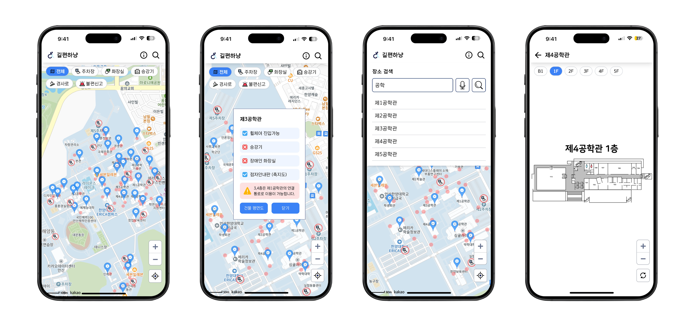

# HYU-ERICA-BarrierFree-Map

> 한양대학교 ERICA캠퍼스 배리어프리맵 프로젝트 '길편하냥'

## Screenshots

## Features
- 배리어프리 시설 정보 조회
  - 장애인 주차장, 장애인 화장실, 승강기, 건물 진입 경사로 등
- 장소 검색
  - 음성 인식으로도 검색 가능
- 웹 접근성 준수
  - 각각의 요소들을 스크린 리더가 읽을 수 있음
- 건물 구조도 조회
- PWA 지원
  - Android, iOS, iPadOS 등에서 웹 앱 설치 가능

## Developers
- Frontend : [이재형](https://github.com/devITae) (컴퓨터학부 21)
- Backend : [정윤성](https://github.com/yunsseong) (컴퓨터학부 20)
- Design : 임동섭 (경영학부 22)

## License
- 한국장애인개발원 - 유니버설디자인서체 ['KoddiUD 온고딕'](https://www.koddi.or.kr/ud/sub1_2)

- [MIT License](https://github.com/devITae/HYU-ERICA-BarrierFree-Map/blob/main/LICENSE)

## Thanks to
[한양대학교 ERICA 인권센터](https://ehrc.hanyang.ac.kr) & 인권센터 서포터즈 '소중한대'
